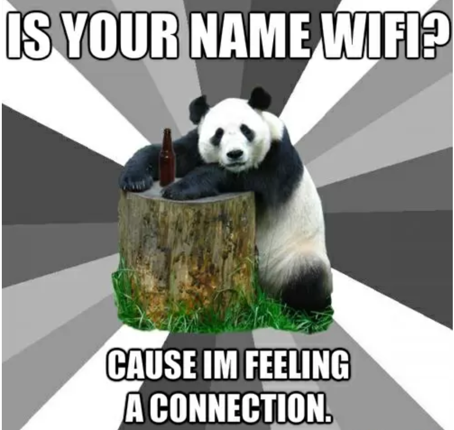
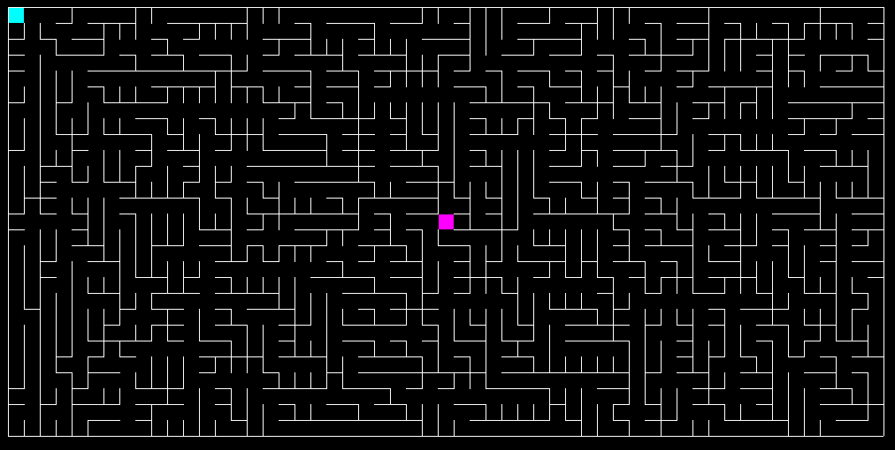
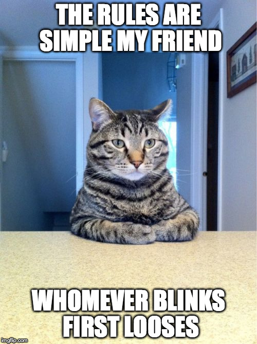

:css: style.css

.. title:: Pixel Pathfinders

----

:data-x: r2100
:data-y: 0
:class: cover-class

Pixel Pathfinders
=================

A new Home
----------

Markus Pöschl & Alex Mayer

.. note::

  To remove the title image, remove the image on the cover slide

----

:class: right-class

What will happen now
--------------------

* 📍 You are here
* 🍴 Buffet in front of the elevator starting around 7:45 PM (Also vegitarian)
* 🐱‍💻 Maze time
* 🚪 Official end is 11 PM

----

:class: full-slide-class

----

:class: right-class

Connectivity
============

Of course you can network (talk to people, share socials and stuff)

But sometimes you NEED network

* Use the wired connection

OR

* WIFI: {Insert WIFI here}
* Pass: {Insert Pass here}

----

What will be doing today?
=========================

* You will solve mazes within a time limit and push the solution to the canvas

----

:class: right-class

And then the rules
==================

* The maze resets periodically
* You have to grab the maze first
* You have to solve the maze locally
* When you are done, push the solution to the canvas
* The first completed pathway wins the round
* Achieve fun to win!

----

:class: right-class

Get help
========

Sample command to get help

.. code-block:: bash

    echo "HELP" | netcat {ip} 1234

----

:class: right-class

Get size
========

Sample command to get the canvas size

.. code-block:: bash

    echo "SIZE" | netcat {ip} 1234

----

:class: right-class

Get pixel color
===============

Sample command to get the pixel color at the given coordinate

.. code-block:: bash

    echo "PX {x} {y}" | netcat {ip} 1234

----

:class: right-class

Set pixel color
===============

Sample command to set the pixel color at the given coordinate

.. code-block:: bash

    echo "PX {x} {y} {rrggbb}" | netcat {ip} 1234

----

:class: right-class

GLHF!
=====

(and feel free to ask!)
-----------------------

