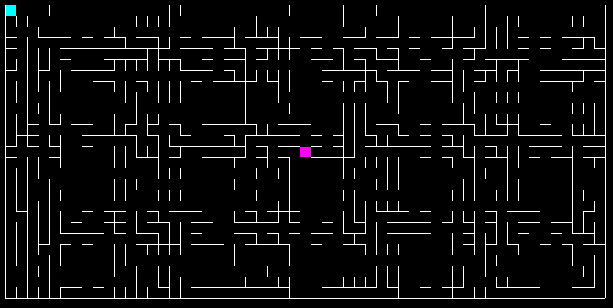

:css: style.css

.. title:: Pixel Pathfinders

----

:data-x: r2100
:data-y: 0
:class: cover-class

Pixel Pathfinders
=================

A new Home
----------

Markus Pöschl & Alex Mayer

.. note::

  To remove the title image, remove the image on the cover slide

----

:class: right-class

Connectivity
============

OFC you can network (talk to people, share socials and stuff)

But sometimes you NEED network

* WIFI: {Insert WIFI here}
* Pass: {Insert Pass here}

.. image:: images/wifi_meme.png
   :width: 400px
   :height: 400px

----

:class: full-slide-class

Sponsor
=======

Ingenics Digital GmbH

{Insert User here}

----

:class: right-class

Important things first
----------------------

* {Insert Food Type here}
* {Insert Food Timeline here}
* Official end is 11 PM

We also have vegetarians covered. ;) {Do we?}

.. image:: images/menu.png
   :width: 600px
   :height: 600px

----

What will be doing today?
=========================

* You will solve mazes within a time limit and push the solution to the canvas

----

:class: right-class

And then the rules
==================

* The maze resets periodically
* You have to grab the maze first
* You have to solve the maze locally
* When you are done, push the solution to the canvas
* The first completed pathway wins the round
* Achieve fun to win!

.. image:: images/rules.jpg

----

:class: right-class

Get help
========

Sample command to get help

.. code-block:: bash

    echo "HELP" | netcat {ip}:{port} -d 1

----

:class: right-class

Get size
========

Sample command to get the canvas size

.. code-block:: bash

    echo "SIZE" | netcat {ip}:{port} -d 1

----

:class: right-class

Get pixel color
===============

Sample command to get the pixel color at the given coordinate

.. code-block:: bash

    echo "PX {x} {y}" | netcat {ip}:{port} -d 1

----

:class: right-class

Set pixel color
===============

Sample command to set the pixel color at the given coordinate

.. code-block:: bash

    echo "PX {x} {y} {rrggbb(aa)}" | netcat {ip}:{port} -d 1

----

GLHF!

(and feel free to ask!)
